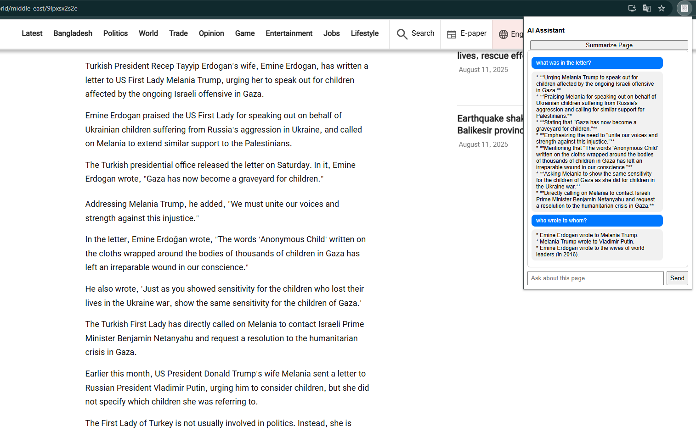

# AI Summarizer & Chatbot Browser Extension

An AI-powered Chrome extension that lets you **summarize web pages** and **ask questions about the content**. It uses a **FastAPI backend** with **Google Gemini** (or OpenAI) for natural language processing.

---

## Features

- Summarize **web pages** in bullet points.  
- Ask **custom questions** about any page.  
- Chat-style interface in the browser popup.  
- Configurable API keys using `.env`.

---

## Tech Stack

- **Frontend:** Chrome Extension (HTML, CSS, JavaScript)  
- **Backend:** Python + FastAPI  
- **AI Model:** Google Gemini (`gemini-2.5-flash`) or OpenAI GPT-4o  
- **Environment Management:** `python-dotenv`

---

## Installation

### Backend

## 1. Clone this repository:

```bash
git clone https://github.com/Asif734/AI_Extension_Blog.git
cd AI_Extension_Blog/backend
```
## 2. Create a virtual environment

```bash
python -m venv venv
source venv/bin/activate  # Linux/macOS
venv\Scripts\activate     # Windows
```
## 3. Install dependencies

```bash
pip install -r requirements.txt
```

## 4. Create .env file

```bash
api_key= "Your gemini api key here"
```
## 5. Run fastapi server

```bash
uvicorn backend.main:app --reload
```
## 6. Chrome Extension

Go to chrome://extensions/ in Chrome.

Enable Developer Mode (top right).

Click Load unpacked and select the extension/ folder.

The extension popup should appear in the browser toolbar.


## 6. Usage

Open a webpage in the browser.

Click the extension icon to open the popup.

Options:

Summarize Page – Summarizes the visible page content in bullet points.

Ask Question – Type a question about the page and get an AI-generated answer.

Messages appear in the chat window.

## 7.File Structure

```bash
project-root/
│
├── backend/
│   ├── main.py          # FastAPI backend
│   └── .env             # API keys (ignored in Git)
│
├── extension/
│   ├── popup.html
│   ├── popup.js
│   ├── content.js
│   ├── manifest.json
│   └── icon.png
│
├── .gitignore
└── README.md
├── requirements.txt
├── .env
```

## 8. Demo Screenshot 


